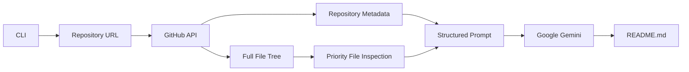
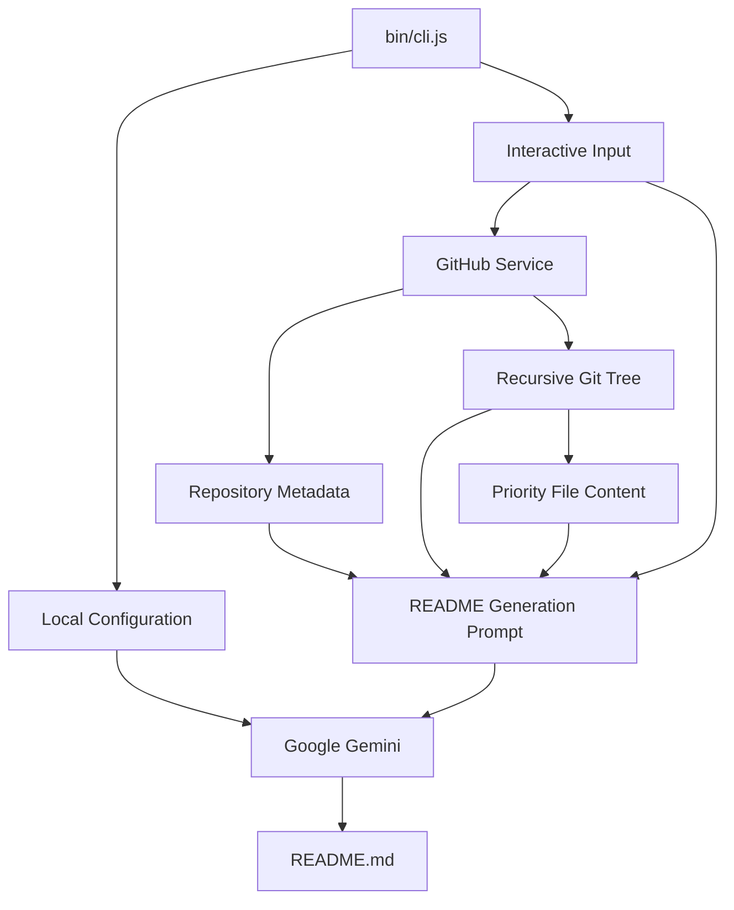

<p align="center">
  
  
  
  
</p>

<h1 align="center">AI README Architect</h1>

<p align="center">
  <strong>Generate polished, GitHub-ready README.md files from real repository context.</strong>
</p>

<p align="center">
  Analyze a GitHub repository → inspect its structure → understand its key files → generate documentation with Google Gemini.
</p>

<p align="center">
  <a href="https://github.com/fang3yuan/ai-readme-gen">Repository</a>
  ·
  <a href="https://github.com/fang3yuan/ai-readme-gen/issues">Issues</a>
  ·
  <a href="https://github.com/fang3yuan/ai-readme-gen/stargazers">Star</a>
</p>

---

## Overview

**AI README Architect** is an interactive Node.js CLI that analyzes GitHub repositories and generates structured `README.md` documentation using **Google Gemini**.

Instead of relying on a repository name or a shallow prompt, the tool collects actual repository metadata, traverses the GitHub file tree, inspects important project files, and provides that context to the AI before generating the final documentation.

The goal is simple:

> **Turn an existing codebase into useful documentation with minimal manual writing.**

---

## How It Works



### Generation Pipeline

| Stage | What happens |
|---|---|
| `1` | Accept a GitHub repository URL |
| `2` | Fetch repository metadata |
| `3` | Traverse the repository using the Git Trees API |
| `4` | Identify and inspect important configuration / entry files |
| `5` | Combine repository context with the README generation prompt |
| `6` | Send the structured context to Google Gemini |
| `7` | Write the generated result to `README.md` |

---

## Features

- **Repository-aware generation** — uses real repository structure and source context.
- **GitHub Trees API integration** — recursively retrieves the project tree.
- **Priority file inspection** — examines important configuration and entry-point files when present.
- **Gemini-powered documentation** — generates the final Markdown using Google's Gen AI SDK.
- **Interactive CLI** — guided repository and configuration workflow.
- **Custom project notes** — provide additional context before generation.
- **Automatic `.git` normalization** — repository URLs ending in `.git` are normalized before processing.
- **Terminal feedback** — progress indicators and styled output using `ora` and `chalk`.
- **Local API-key configuration** — stores the Gemini API key in the user's local configuration directory.
- **Direct `readme-gen` command** — supports local CLI linking through npm.
- **No project-specific README template required** — documentation is generated from the analyzed repository context.

---

## Tech Stack

<p align="center">
  
  
  
</p>

| Layer | Technology |
|---|---|
| Runtime | Node.js |
| Module System | ES Modules |
| AI | `@google/genai` |
| GitHub Integration | GitHub REST / Trees API |
| CLI Framework | `commander` |
| Interactive Prompts | `inquirer` |
| HTTP | `node-fetch` |
| Terminal UI | `chalk`, `ora` |

---

## Project Structure

```text
ai-readme-gen/
├── bin/
│   └── cli.js
│
├── src/
│   ├── config.js
│   ├── githubService.js
│   └── prompts.js
│
├── package.json
└── README.md
```

<details>
<summary><strong>Core files</strong></summary>

### `bin/cli.js`

CLI entry point responsible for:

- command handling
- interactive prompts
- repository URL validation
- repository analysis workflow
- Gemini generation
- writing the final `README.md`

### `src/githubService.js`

Handles GitHub repository analysis:

- repository metadata
- default branch detection
- recursive Git Trees API requests
- raw file retrieval

### `src/config.js`

Manages the local Gemini API-key configuration.

### `src/prompts.js`

Contains the system prompt used to guide Gemini's README generation.

### `package.json`

Defines the CLI package, executable command, scripts, and dependencies.

</details>

---

## Requirements

Before running the project, make sure you have:

- **Node.js** with ES Module support
- **npm**
- A **Google Gemini API key**
- Internet access for GitHub and Gemini API requests

No `.env` file is required by the current implementation.

---

## Installation

### 1. Clone

```bash
git clone https://github.com/fang3yuan/ai-readme-gen.git
cd ai-readme-gen
```

### 2. Install dependencies

```bash
npm install
```

### 3. Configure Gemini

Run:

```bash
npm start config
```

Enter your Gemini API key when prompted.

The key is stored locally at:

```text
~/.config/ai-readme-architect/config.json
```

> Your API key is not required to be committed to the repository or placed inside `.env`.

---

## Quick Start

Run the generator:

```bash
npm start
```

Or directly:

```bash
node ./bin/cli.js
```

The CLI will ask for:

1. GitHub repository URL
2. Optional custom notes

It then analyzes the repository and creates:

```text
README.md
```

in the current working directory.

---

## CLI

### Configure API Key

```bash
npm start config
```

### Generate README

```bash
npm start
```

### Run Directly

```bash
node ./bin/cli.js
```

### Use as a Local Command

```bash
npm link
```

Then:

```bash
readme-gen
```

---

## Repository Input

The generator accepts GitHub repository URLs such as:

```text
https://github.com/owner/repository
```

A `.git` suffix is also normalized automatically:

```text
https://github.com/owner/repository.git
```

The repository must be accessible through the GitHub API.

---

## What Gets Analyzed?

The generator retrieves the repository's metadata and complete Git tree, then selectively inspects high-value files when they exist.

Priority files include:

```text
package.json
requirements.txt
Dockerfile
docker-compose.yml
go.mod
Cargo.toml
index.js
main.py
app.py
src/index.js
src/main.ts
src/App.tsx
```

This gives the model both:

- a **global view** of the repository structure
- **deeper context** from important project files

The resulting prompt also includes:

- repository owner
- repository name
- default branch
- GitHub description
- GitHub topics
- complete file manifest
- raw file URLs
- user-provided notes

---

## Generated Documentation

The generated README is designed to adapt to the repository rather than blindly applying the same structure to every project.

Depending on the analyzed codebase, the output may include:

- project overview
- features
- technology stack
- architecture
- project structure
- requirements
- installation
- quick start
- usage
- CLI/API information
- configuration
- development information
- contributing guidance
- troubleshooting
- license information

The generator is instructed to stay grounded in the repository data and avoid inventing commands, configuration, dependencies, or capabilities that are not supported by the analyzed project.

---

## Configuration

Configuration is stored outside the project directory:

```text
~/.config/
└── ai-readme-architect/
    └── config.json
```

Example structure:

```json
{
  "GEMINI_API_KEY": "your-api-key"
}
```

Do **not** commit this file to Git.

---

## Architecture



---

## Design Principles

### Repository Grounding

Documentation should reflect the actual project rather than assumptions about what the project *might* contain.

### Useful Over Exhaustive

The generator focuses on information that helps a developer understand, install, run, and work with the project.

### Adaptive Structure

Different repositories need different documentation. The generated README should scale its structure according to the complexity of the analyzed codebase.

### Developer-Focused Presentation

Generated documentation can use:

- badges
- compact tables
- code blocks
- collapsible sections
- Mermaid diagrams
- structured headings
- repository links

Visual elements should improve navigation and comprehension rather than exist purely for decoration.

---

## Security

Keep API credentials out of source control.

The Gemini API key is stored in the user's local configuration directory rather than inside the generated repository.

Before publishing or sharing a generated project, verify that:

- no API keys are present
- no cookies or tokens are included
- no private repository URLs were accidentally documented
- generated configuration examples contain placeholders rather than real secrets

---

## Limitations

AI-generated documentation should still be reviewed before publication.

Repository analysis can only document information that is available through the accessible repository and inspected files. Dynamic runtime behavior, private infrastructure, undocumented deployment systems, and external services may not be fully represented.

The generated README should therefore be treated as a strong starting point, followed by a quick human review.

---

## Development

Install dependencies:

```bash
npm install
```

Run the CLI during development:

```bash
npm start
```

Run the configuration command:

```bash
npm start config
```

The current package does not define a dedicated test or build script.

---

## Contributing

Contributions are welcome.

A useful contribution can include:

- improving repository analysis
- improving prompt quality
- adding support for additional project ecosystems
- improving CLI usability
- fixing documentation-generation edge cases
- improving error handling
- improving generated README structure

Before opening a pull request:

1. Keep changes focused.
2. Avoid introducing unnecessary dependencies.
3. Verify the CLI still starts correctly.
4. Test the affected workflow.
5. Update documentation when behavior changes.

---

## License

No license file is currently included in the repository.

If you intend to distribute the project as open-source software, add an explicit license that defines how others may use, modify, and redistribute it.

---

## Repository

<p align="center">
  <a href="https://github.com/fang3yuan/ai-readme-gen">
    <strong>View on GitHub</strong>
  </a>
  ·
  <a href="https://github.com/fang3yuan/ai-readme-gen/issues">
    <strong>Report an Issue</strong>
  </a>
  ·
  <a href="https://github.com/fang3yuan/ai-readme-gen/stargazers">
    <strong>Star the Project</strong>
  </a>
</p>

<p align="center">
  Built for developers who would rather generate documentation than write it from scratch.
</p>
