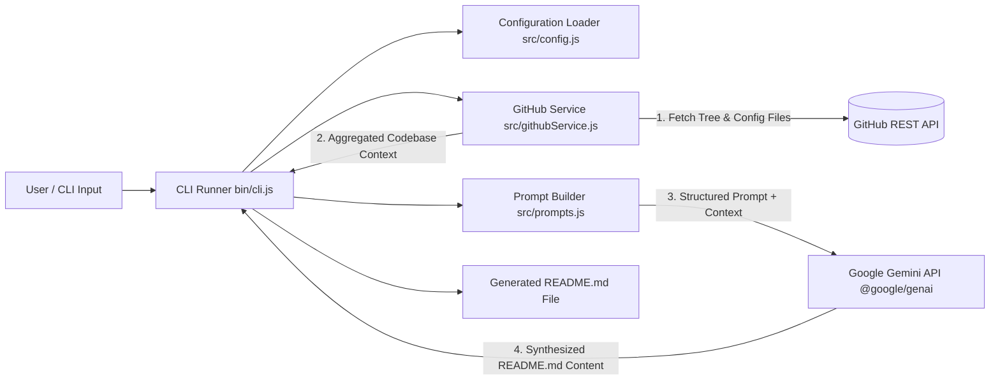

# ai-readme-architect

[](https://nodejs.org/)
[](LICENSE)
[](https://github.com/fang3yuan/ai-readme-gen/blob/main/package.json)
[](https://nodejs.org/api/esm.html)

An interactive CLI tool that automates the generation of documentation for GitHub repositories. By integrating the GitHub Git Trees API with Google's Gemini 3.8 model via the `@google/genai` SDK, it inspects repository directory structures and critical configuration files to generate structured, production-ready `README.md` files.

---

## Table of Contents

- [Overview & Features](#overview--features)
- [Architecture](#architecture)
- [Project Structure](#project-structure)
- [Prerequisites](#prerequisites)
- [Environment Configuration](#environment-configuration)
- [Installation & Quick Start](#installation--quick-start)
- [Usage & CLI Reference](#usage--cli-reference)
- [Contributing](#contributing)
- [License](#license)

---

## Overview & Features

`ai-readme-architect` eliminates boilerplate documentation authoring by performing structural codebase analysis before running contextual LLM synthesis:

- **Recursive Tree Inspection**: Traverses remote repositories using the GitHub Trees API without requiring full repository cloning.
- **Priority File Analysis**: Automatically identifies and reads configuration declarations (e.g., `package.json`, `Dockerfile`, `go.mod`, `requirements.txt`).
- **Gemini 3.8 Integration**: Uses `@google/genai` to synthesize technical documentation adhering strictly to detected dependencies, commands, and project layouts.
- **Interactive & Headless Modes**: Provides interactive prompt flows via `inquirer` as well as programmatic parameter inputs via `commander`.
- **Terminal UI**: Real-time operational feedback with spinners (`ora`) and formatted logs (`chalk`).

---

## Architecture

The CLI acts as an orchestrator between the target GitHub repository and the Google Gemini inference API:



---

## Project Structure

<details>
<summary>Click to view repository directory tree</summary>

```text
ai-readme-gen/
├── bin/
│   └── cli.js              # Executable entry point for CLI executions
├── src/
│   ├── config.js           # Environment and runtime configuration loader
│   ├── githubService.js    # GitHub Git Trees and file content fetching logic
│   └── prompts.js          # System prompt definitions and context builder
├── package.json            # Project manifest, CLI bin bindings, and dependencies
└── README.md               # Repository documentation
```
</details>

### Source File Links

- [`bin/cli.js`](https://raw.githubusercontent.com/fang3yuan/ai-readme-gen/main/bin/cli.js): Configures Commander options, Inquirer prompts, and coordinates execution.
- [`src/config.js`](https://raw.githubusercontent.com/fang3yuan/ai-readme-gen/main/src/config.js): Resolves environment variables and sets client options.
- [`src/githubService.js`](https://raw.githubusercontent.com/fang3yuan/ai-readme-gen/main/src/githubService.js): Interfaces with GitHub Trees API to inspect and download file trees and configuration manifests.
- [`src/prompts.js`](https://raw.githubusercontent.com/fang3yuan/ai-readme-gen/main/src/prompts.js): Formats system instructions and context inputs for Gemini 2.5.
- [`package.json`](https://raw.githubusercontent.com/fang3yuan/ai-readme-gen/main/package.json): Defines dependencies (`@google/genai`, `commander`, `inquirer`, `ora`, `chalk`) and executable scripts.

---

## Prerequisites

- **Node.js**: Version 18.0.0 or higher (Node.js with native ESM support).
- **npm** or **yarn** / **pnpm**.
- **Gemini API Key**: Access token for Google Gemini (`@google/genai`).
- **GitHub Personal Access Token (Optional)**: Recommended to prevent rate-limiting when inspecting public repositories, or required for private repositories.

---

## Environment Configuration

Create a `.env` file in the root directory or export the following variables in your execution environment:

| Variable | Required | Description | Example |
| :--- | :--- | :--- | :--- |
| `GEMINI_API_KEY` | **Yes** | API key for authenticating with Google GenAI / Gemini 2.5 API. | `AIzaSyD...` |
| `GITHUB_TOKEN` | Optional | GitHub personal access token (PAT) for authenticated GitHub API requests. | `ghp_...` |

---

## Installation & Quick Start

### 1. Clone Repository

```bash
git clone https://github.com/fang3yuan/ai-readme-gen.git
cd ai-readme-gen
```

### 2. Install Dependencies

```bash
npm install
```

### 3. Setup Environment Variables

```bash
cp .env.example .env
# Edit .env and supply GEMINI_API_KEY
```

### 4. Link CLI Globally (Optional)

To use the `readme-gen` command from any directory:

```bash
npm link
```

---

## Usage & CLI Reference

### Running via npm Script

Run the tool interactively:

```bash
npm start
```

### Running via Binary

If linked globally or invoked via direct path:

```bash
# Direct execution
node ./bin/cli.js

# Or globally linked command
readme-gen
```

### Command-Line Arguments & Options

The CLI supports non-interactive arguments:

```bash
readme-gen [options]
```

| Option | Flag | Description | Default |
| :--- | :--- | :--- | :--- |
| `--repo <url|owner/repo>` | `-r` | Target GitHub repository URL or `owner/repo` string | `undefined` (triggers prompt) |
| `--output <path>` | `-o` | Destination path for the generated markdown file | `./README.md` |
| `--branch <branch>` | `-b` | Repository branch to inspect | `main` |
| `--help` | `-h` | Display CLI usage details and exit | — |
| `--version` | `-V` | Output version number | — |

### Example

Generate documentation for a specific repository and output to a custom location:

```bash
readme-gen --repo https://github.com/fang3yuan/ai-readme-gen --output ./GENERATED_README.md
```

---

## Contributing

1. Fork the repository.
2. Create a feature branch:
   ```bash
   git checkout -b feature/new-capability
   ```
3. Commit your modifications:
   ```bash
   git commit -m "feat: add support for local filesystem analysis"
   ```
4. Push to the branch:
   ```bash
   git push origin feature/new-capability
   ```
5. Submit a Pull Request.

---

## License

This project is licensed under the MIT License. See the `LICENSE` file for details.
