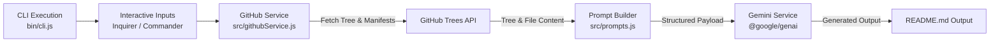

# ai-readme-architect

An interactive CLI tool that analyzes GitHub repositories using the GitHub Trees API and generates structured `README.md` documentation using Google Gemini.

---

## Overview

`ai-readme-architect` automates the creation of repository documentation. By fetching repository trees and key source files via GitHub's API, the tool compiles contextual project information, formats structured prompt templates, and queries Google Gemini (`@google/genai`) to generate technical documentation ready for GitHub.

---

## Features

- **Automated Repository Traversal**: Interfaces with the GitHub Trees API to inspect repository directory trees and detect project configuration files.
- **AI-Powered Synthesis**: Leverages the Google Gen AI SDK (`@google/genai`) and Gemini models to generate documentation.
- **Interactive Terminal Workflow**: Uses `inquirer` and `commander` for user prompts and parameter inputs directly in the console.
- **Visual Progress Indicators**: Displays real-time terminal feedback using `ora` spinners and `chalk` styling during API operations.
- **Environment-Driven Configuration**: Loads local environment settings and credentials seamlessly with `dotenv`.

---

## Tech Stack

- **Runtime**: Node.js (ES Modules, `"type": "module"`)
- **AI SDK**: `@google/genai`
- **CLI Utilities**: `commander`, `inquirer`, `ora`, `chalk`
- **Networking**: `node-fetch`
- **Configuration**: `dotenv`

---

## Architecture & Workflow



---

## Project Structure

```text
ai-readme-gen/
├── bin/
│   └── cli.js            # CLI executable entry point (`readme-gen`)
├── src/
│   ├── config.js         # Configuration and environment loaders
│   ├── githubService.js  # GitHub Trees API fetching and tree traversal
│   └── prompts.js        # Prompt engineering templates for Gemini
└── package.json          # Package definitions, scripts, and dependencies
```

---

## Requirements

- **Node.js**: Modern LTS version supporting ES Modules.
- **Gemini API Key**: A valid Google AI Studio API key for model access.
- **GitHub API Access**: Access to GitHub API (personal access token may be needed depending on API rate limits).

---

## Installation

1. **Clone the repository:**
   ```bash
   git clone https://github.com/fang3yuan/ai-readme-gen.git
   cd ai-readme-gen
   ```

2. **Install dependencies:**
   ```bash
   npm install
   ```

3. **Configure environment variables:**
   Create a `.env` file in the project root:
   ```env
   GEMINI_API_KEY=your_gemini_api_key_here
   GITHUB_TOKEN=your_github_token_here
   ```

---

## Usage

### Run via npm script

```bash
npm start
```

### Run directly via Node

```bash
node ./bin/cli.js
```

### Link locally as a CLI binary

You can link the package locally to use the `readme-gen` binary command:

```bash
npm link
readme-gen
```

Follow the interactive terminal prompts to specify the repository target and generate your `README.md`.